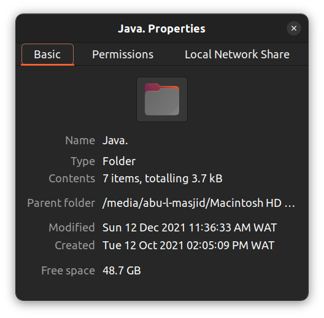

# Java Programming Codes Repository

This repository is an archive of beginner-level Java programs I developed as part of an introductory programming course during a university course (CSC301: Object Oriented Programming (OOP) in Java). These programs were written and executed using the VS Code editor and the command-line interface before transitioning to a more advanced IDE, the Eclipse IDE to be precise. These codes cover some essential Java programming concepts and serve as a foundation for learning object-oriented programming.
It is aimed at showcasing my fundamental Java skills and offering a resource for revisiting or demonstrating foundational programming concepts.
Created and completed between Tue, 12th Oct 2021 and Tue, 12th Dec 2021.

## Features

- **Topics Covered**:
  - Basic Java syntax and structure
  - Control flow (if-else, loops)
  - Functions and methods
  - Simple object-oriented programming concepts
  - Working with data types and variables

## Tools & Environment

- **Editor Used**: Text editor (VS Code) and Java Compiler (JDK)
- **Programming Language**: Java
- **Execution**: Command-line interface

## Folder Structure

- **Source Files**: `.java` files containing the source code
- **Compiled Files**: `.class` files generated after compilation
- **images**: Screenshot file for reference.

## Screenshots

Here's a screenshot of the project folder properties:

